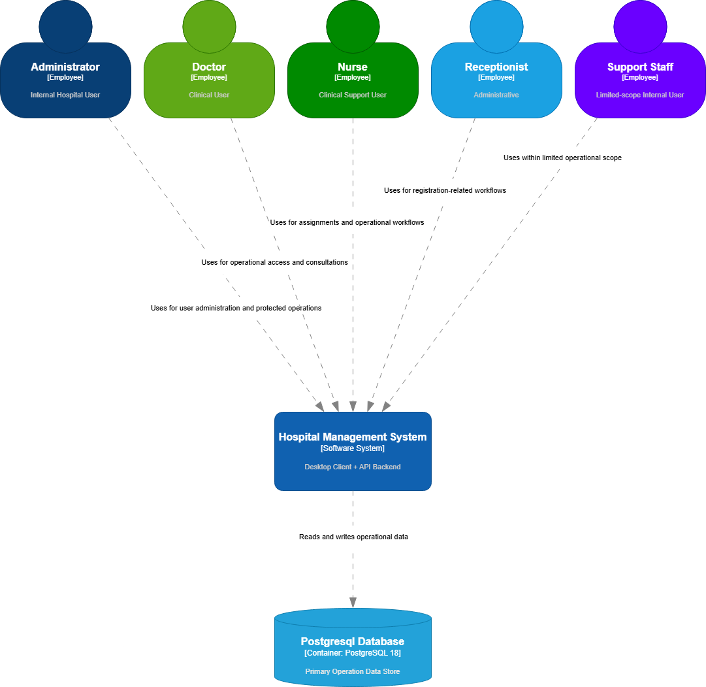

# System Context Diagram

## Document Control

| Field          | Value        |
|:-------------- |:------------ |
| Document Owner | Project Team |
| Status         | Active       |
| Version        | 1.0          |
| Last Updated   | 2026-05-04   |

## Purpose

Provide the C4 Level 1 system context view: system boundary, primary user roles, external dependencies, and high-level information flows.

## Scope

This context diagram reflects the current project scope:

- A desktop client used by internal hospital staff
- A backend API that centralizes business logic
- A PostgreSQL database as the primary data store

The diagram intentionally stays at the system context level. Internal containers and components are described in the architecture overview and lower-level design documents.

## System Under Consideration

| Item                             | Description                                                                                                                                                                                        |
|:-------------------------------- |:-------------------------------------------------------------------------------------------------------------------------------------------------------------------------------------------------- |
| Hospital Management System (HMS) | Internal hospital application used to authenticate staff, register users, manage staff and patient records, assign nursing staff, query operational data, and generate dummy data for development. |

## Primary Actors

| Actor         | Description                           | Main Interactions                                                                                     |
|:------------- |:------------------------------------- |:----------------------------------------------------------------------------------------------------- |
| Administrator | Internal operational or platform user | Registers application users, manages operational records, and accesses protected features.            |
| Doctor        | Clinical user                         | Uses the system to access operational functions and consult hospital data relevant to care workflows. |
| Nurse         | Clinical support user                 | Uses the system for assignments and operational consultation workflows.                               |
| Receptionist  | Administrative user                   | Uses the system for registration-oriented workflows and operational queries.                          |
| Support Staff | Limited-scope internal user           | Uses the system within a restricted operational context.                                              |

## External Systems and Dependencies

| External System     | Description                   | Relationship to HMS                                                                                      |
|:------------------- |:----------------------------- |:-------------------------------------------------------------------------------------------------------- |
| PostgreSQL Database | Primary relational data store | Stores hospital master data, users, staff, patients, visits, surgeries, and related operational records. |

## C4 System Context Diagram

## Boundary Notes

- The HMS is the system under consideration.
- The desktop client and Flask backend are represented as a single system at this C4 level.
- PostgreSQL is modeled as an external dependency from the context perspective because it sits outside the logical HMS application boundary in a separate infrastructure role.
## Modeling Assumptions

- All user actors are internal hospital staff or internal operational users.
- Patients are not direct users of the current system scope.
- External government, insurance, laboratory, or billing integrations are not currently implemented and are therefore excluded from the diagram.
- Reporting and export tools such as Power BI are not currently connected in the implemented runtime flow and are excluded from the current context view.

## Out of Scope for This Diagram

- Internal backend module decomposition
- Route and service-level interactions
- Deployment topology and network segmentation
- Database table structure
- Detailed authentication sequence logic
